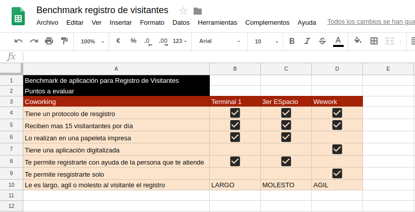
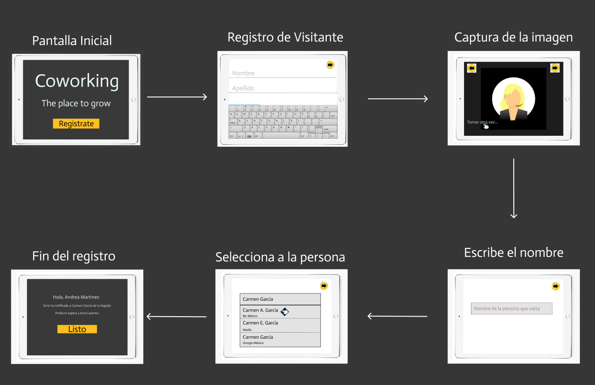
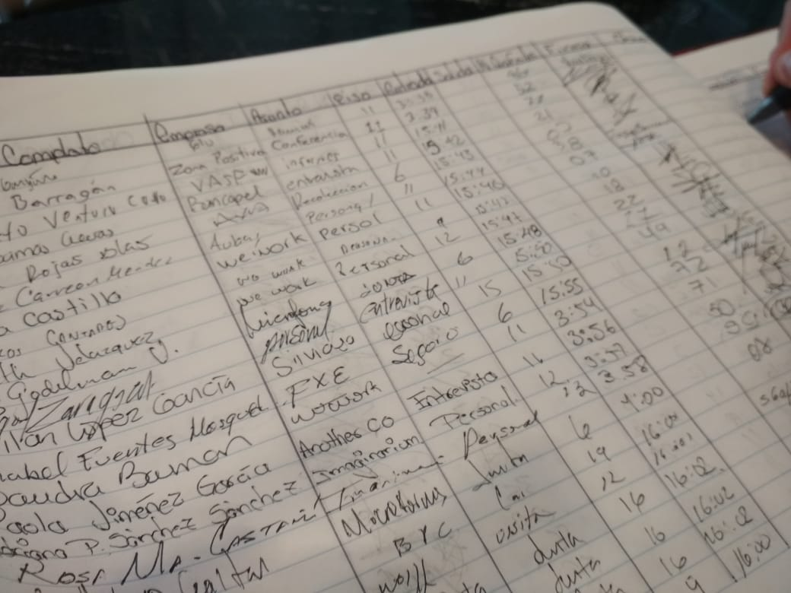
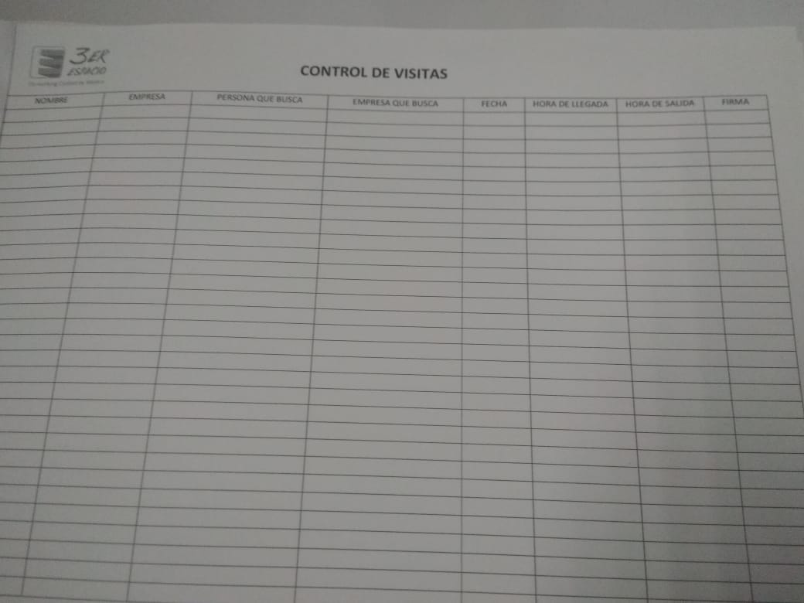

# Creando un registro de visitantes

## Preámbulo

Los registros de visitantes son muy útiles para empresas y oficinas privadas, pero desde hace unos años se extendió por países como EEUU, Francia,  Alemania, India, México; entre muchos más una práctica denominada COWORKING [_Mas info_](http://www.comunidadcoworking.es/que-es-coworking/), que se refiere a un espacio de trabajo compartido e ispirador, que impulsa y fomenta la co-creación , donde se preocupan por crear comunidad y valor añadido.

Aqui los profesionales que no comparten ni empresa ni sector de actividad, se unen para trabajar en un mismo espacio. Luego de una junta con las empresas que conforman estos coworking se presento un proyecto para automatizar y digitalizar su registro de visitantes.

## Introducción

De acuerdo a lo anteriormente planteado , y luego de una reunión con varias empresas que trabajan en el coworking Terminal 1 , se no ha encargado la creación de un registro de visitantes en el cual les gustaría invertir, desean que sea ágill, rápida y fácil de manejar.

## Objetivos

El objetivo principal es construir una aplicación que se pueda visualizar en pantallas pequeñas (tablets, ipad) y pantallas grandes (computadoras/es, laptops, etc.) y que sea responsive.

Objetivos específicos:

* Entender las necesidades de los usuarios para los que se creará el producto.
* Testear el producto con 5 usuarios para lograr un producto eficaz, y que se pueda lanzar al mercado.
* Diseñar y construir una aplicación, que sea que sea fácil de manipular, amigable al usuario, además de que se pueda utilizar en distintos dispositivos como tablets y desktops.

# Consideraciones Generales para UX:

* Diseñar la experiencia de la aplicación (flujo, interacción, etc.).
* Identificar, documentar y priorizar las historias de usuario.
* Crear el diseño visual de la interfaz.
* Identificar al usuario que accede a este servicio
* Identificar puntos de contacto y mejora para el usuario, tanto de atención (coworking) como para el          cliente que accede.
* Documentar el proceso de investigación.

# Consideraciones Generales para Front-end

* Implementar la interfaz de usuario diseñada (HTML/CSS/JS).
* Identificar, documentar y priorizar las historias de usuario.
* Todos los desarrollos deben incluir pruebas unitarias.
# General

* Responsive : Este proyecto se verá  bien en dispositivos de pantallas grandes (computadoras/es, laptops, etc.) y pequeñas (tablets, ipad).

* Enfoque: Se puede utilizar para cualquier tipo de empresa, gracias a su gran flexibilidad. Además brindará a los visitantes una mejor impresión al llegar al coworking, mejorando así su experiencia de usuario desde su llegada hasta su salida, ya que sera fácil de entender, utilizar , rápido y eficaz.
En el caso de los coworking que quieran tener esta aplicación , podrán disfrutar de tener el control de las personas que ingresan , nombre del visitante, foto del mismo y la persona a quien vienen a visitar.

# Descripción del manejo de la aplicación:

El proceso es muy sencillo, llega el visitante, el cual se encontrá con un disposito como una tablet, donde su primera pantalla tedrá un botón que le permitirá registrarse, dejando su nombre y apellido, luego se obtendrá la imagen del visitante el cual tomará el mismo , luego dará “presioará” la fecha que se encuentra en el lado superior derecho, la siguiente vista le pedire que ingrese el nombre de la persona que viene a visitar, y se desplegará una lista de todas aquellas personas que laboren alli con ese nombre pero con su respectiva empresa para poder identificarlos, una vez corroborada dicha infomación el usuario podrá visualizar una pantalla final en la cuál se le informa que ya se le fue informada a la persona en cuestión de su visita y con mucha cortesí se le pide que espere y tome asiento.

# Beneficios de la aplicación:

* Mejora la seguridad.
* Ayuda a tener una mejor organización.
* Permite conocer quien se encuentra dentro de las instalaciones en cualquier momento.
* Protege al mismo tiempo la confidencialidad del visitante.
* Facilita la bsuqueda e identificación de los visitantes.

# Características Generales de la aplicación:

* Fácil, intuitivo y rápido.
* Permite el uso de cámaras para realizar la fotografía.
* Permite tener los nombres de los visitantes y ser guardados en una base de datos.

# Proto-usuario

Las empresas que laboran en Terminal 1 (coworking) , sienten que el la manera en como registran a los visitantes es bastante arcaica, ya que ellos utilizan un cuaderno de notas para realizar el registro de manera escrita y eso ocasiona molestia en la mayoría de sus visitantes. Por ende quieren una aplicación automatizada que les permita a los visitantes poder registrarse ellos solos de manera rápida, fácil y sin tener que dar sus datos a un extraño.

# Historias de usuarios (Visitantes)

Yo , como visitante quiero no tener que dar mi infomación a una persona extraña.

Yo , como visitante quiero no tener que dejar mi indentificación a una persona extraña, por miedo a que me la pierda.

Yo , como visitante quiero poder registrarme de manera fácil y rápida en algún dispositivo automatizado, porque no me gusta escribir.

# Historias de usuarios (Recepción)

Yo, como recepcionista de un coworking, quiero no tener que pedirle datos a los visitantes porque eso me quita mucho tiempo en mis otras labores.

Yo, como recepcionista de un coworking, quiero un sistema automatizado que permita de manera fácil, rápida y entendible poder registrarse sin necesidad de yo estar presente.

Yo, como recepcionista de un coworking, quiero poder tener en mi computadora todos los registros los visitantes , por cualquier infomación que requiera el personal que aquí labora.

# Alcances esperados con la aplicación de Registro de Visitantes

Con esta aplicación, se espera poder llevar un control de todas las personas (visitantes) que ingresan al coworking, mediante un registro fotográfico digitalizado de todos y cada uno de los visitantes. Poder realizar consultas en la base de datos de cualquier visitante que soliciten. Esto a nivel de la empresa.

Ahora bien a nivel del visitante, agilizar su proceso de registro, no tener que compartir su infomación con una persona extraña, que por cuestión de tiempo el registrarse se le sea fácil, rápido y muy sencillo.

# Investigación

Se realizó una investigación en la cual se comparan los diferentes tipos de Coworking que existen a nivel mundial. Aquí un enlace de la misma.

 [_Click aquí_](https://docs.google.com/presentation/d/1xmvGOvEaOghzcFiowpBZyx2NfQ2B4Z9QtKZItzku70k/edit?usp=sharing)

###  Realizó un Benchmark de los coworking a lo cuales nos dirigimos a realizar entrevistas y conocer más acerca de su como manejan ellos el registro de visitantes:

Como siguiente paso se realizaron algunos  sketch a lapiz y papel donde se plasma a grandes rasgos la interfaz con los elementos que ayudaran con la interacción de la interfaz. Aqui en el link de la secuencia de sketch :

[_Click aquí_](https://docs.google.com/presentation/d/1OKGu0rqYmk2novQA1ctLZfp-BxMHaH20vllV8BTN8s0/edit?usp=sharing)

Una vez que se definieron las nececidades de nuestro producto comenzamos con un User Flow, para ayudarnos  a comprender el comportamiento  y asi poder materializar frente al cliente las interacciones de los usuarios con el producto, llegando asi al funcionamiento del producto solicitado, como se muestra a continuación:

Luego de observar como se vería nuestra interfaz en lapiz y papel , y plasmando todos los requerimientos que se necesitaban se procedió a realizar a color  las interfaces con ayuda de Figma. Se buscó que nuestra interfaz  fuera los mas amigable posible , fácil de usar pero sobre todo fácil de entender para el usuario.

Aquí en link de los mismos:

## Entrevistas a 3 Coworking

Preguntas realizadas:

* Nombre de la persona a entrevistar o nombre del coworking visitado.
* En promedio, ¿ Cuántas personas visitan al día el edificio?
* ¿Cómo realizan el registro de los visitantes?
* Método que utilizan :¿ Manual o automatizado?
* ¿Cómo mejorarían la experiencia al momento de registrarte?

### Coworking- TERMINAL 1

* Miriam Castañeda- Recepcionista( tiene 1 mes en la empresa ).
* 50 personas o más visitan al día el edificio. ( Por juntas de trabajo, por pagos, entevstas de trabajo,etc)
* Vigilancia los recibe o los mandan con la chica de recepción, y alli se registran donde les piden el nombre, empresa con la que se vienen a ver y luego de esto se le notifica a la persona en cuestión.
* Método: Manual.
* La señorita me comenta que es muy sencillo y que no le ve ninguna dificultad a la hora de registrar a los viitantes.

### Coworking- 3er Espacio

* Karen Aldana- Gerente de Operaciones ( 3 años laborando en la empresa).
* De 10 a 15 personas visitan al día el edificio.
* Manejan un sistema de acceso que se llama Acces Pro ( pero es solo para las personas que laboran allí, )
* Por medio de una papeleta que tiene impresa tienen que poner el nombre, la persona que buscan, la hora de llegada y la hora de salida (la cual comenta, que no marcan su hora de salida todo el tiempo) y su firma.
* Tocan el interphone y se les pregunta con quien vienen, y si esta correcto le dan acceso pero tienen que subir hasta el 4to piso a registrarse y luego bajar al 2do o 3er piso que es donde están las oficinas. Comenta la chica que es bastante tedioso para los visitantes.
* Comenta que le gustaria un sistema digitalizado el cual puedan tener en un ipad y que los registros se guarden automáticamente en la nube.

### A continuación se mostrarán las fotografías del fotmato manual que utilizan para los registros, se mostrará un link con los audios de 2 de las entrevistas realizadas y un link que los llevará al video que se realizó en la 3era enrevista, la cual cabe acotar fue meramente visual ya que no pudimos conversar con alguna persona que trabajará en dicho coworking.

Audio y papeleta de la entrevista a Miriam Castañeda de Terminal 1:

Audio y papeleta de la entrevista a Karen Aldana de 3er ESpacio:

Video realizado en el Coworking-Wework

